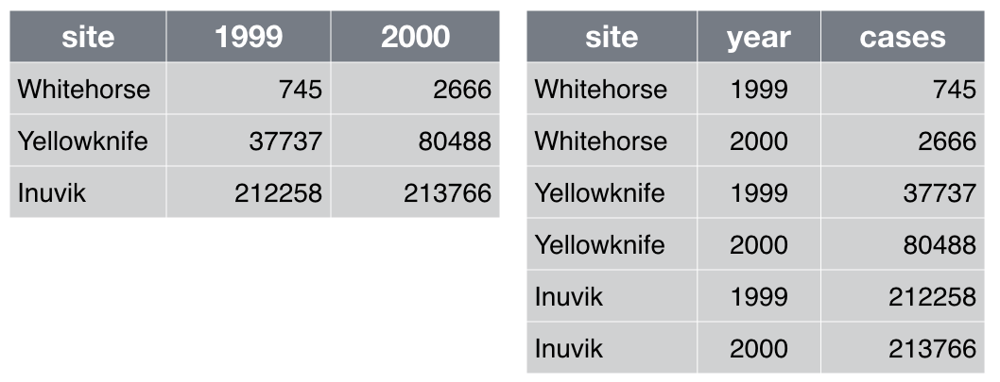

::::::::::::::::::::::::::::::::::::::: objectives

- Identify problems with data management practices
- Understand what raw data is
- Understand what backing up data means and why it is important to back up in more than one location
- Be able to decide on appropriate file names and identifiers
- Be able to create analysis ready datasets
- Understand the importance of documenting your process
- Understand what a DOI is and its usefulness

::::::::::::::::::::::::::::::::::::::::::::::::::

:::::::::::::::::::::::::::::::::::::::: questions

- What is data management?
- What data should I back up, and how?
- How can I share my data effectively?

::::::::::::::::::::::::::::::::::::::::::::::::::

## Data management

Data within a project may need to exist in various forms, ranging from what first arrives to what is actually used for the primary analyses.
Data management is the process of storing, documenting, organizing, and sharing the data created and collected during a project.
Our recommendations have two main themes. One is to work towards ready-to-analyze data incrementally, documenting both the intermediate data and the process. We also describe the key features of "tidy data", which can be a powerful accelerator for analysis [[wickham2014](https://www.jstatsoft.org/article/view/v059i10), [hart2016](https://journals.plos.org/ploscompbiol/article?id=10.1371/journal.pcbi.1005097)].

:::::::::::::::::::::::::::::::::::::::  challenge

## Data management problems (5 minutes)

In your opinion, what can go wrong when you have poor data management? Write down 2 issues in the collaborative document.

:::::::::::::::  solution

## Solution

- Data loss
- Data corruption, making data unusable
- Running out of storage capacity, making it hard to save data
- Confusion: what does this data mean? where does it come from? what is its purpose?
- Versioning issues: Which version of the data made this figure? Which version of the analysis script was used for the manuscript?

:::::::::::::::::::::::::

::::::::::::::::::::::::::::::::::::::::::::::::::

](fig/ew-data-loss.png){alt="A comic strip titled 'The four stages of data loss' and subtitled 'dealing with accidental deletion of months of hard-earned data' by PhD Comics. It's based on the common theory of five stages of grief. The first panel is labelled 'stage 1: denial' and shows a man sitting behind a computer. A thought bubble above his head reads 'I did not just erase all my data. I surely made a back-up somewhere'. The second panel is labelled 'stage 2: anger' and shows the man shaking his computer. A speech bubble above his head shows he is shouting 'you stupid piece of crap! Where's my data?!'. The third panel is labelled 'stage 3: depression'. It shows the man crying, the broken computer beside him. He thinks 'Why? Why me?'. The fourth and final panel is labelled 'stage 4: acceptance'. It shows the man coming to terms with what has happened. He says 'I'm never going to graduate'."}

## Save the raw data

:::::::::::::::::::::::::::::::::::::::  challenge

## Backing up your data (5 minutes)

Which of the following do you believe are good ways and bad ways of backing up your data?

- Commercial cloud service
- In-house cloud service (operates similarly to a commercial cloud service but with servers and infrastructure maintained by your organization)
- USB pen-drive
- External hard-drive
- My laptop
- My workstation's hard-disk
- Network drive

:::::::::::::::  solution

## Solution

- Commercial cloud service: it depends. Where are the servers located? How secure is it? How reliable is it? Do you have to pay for the service and what happens to your data if you can no longer afford it?
- In-house cloud service: this is a good way to back up your data (usually). You have local support. It is probably compliant with funders and data security guidelines for most data sets. If you work with particularly sensitive data (for example data of patients), we suggest still discussing with IT and/or data security officers.
- USB pen drive: definitely not! Pen-drives are prone to dying (and your data with it). It also raises data security issues and they can be easily lost.
- External hard-drive: see above.
- My laptop: it is good as a temporal storage solution for your active data. However, you should back it up appropriately.
- My workstation's hard-disk: it is good as a temporal storage solution for your active data. However, you should back it up appropriately.
- Network drive: this is a good way to back up your data (usually). You have local support. It is probably compliant with funders and data security guidelines.
  
  

:::::::::::::::::::::::::

::::::::::::::::::::::::::::::::::::::::::::::::::

Backing up your data is essential, otherwise it is a question of when (not if) you lose it.

Where possible, save data as originally generated (i.e. by an
instrument or from a survey). It is tempting to overwrite raw data
files with cleaned-up versions, but faithful retention is essential
for re-running analyses from start to finish; for recovery from
analytical mishaps; and for experimenting without fear. Consider
changing file permissions to read-only or using spreadsheet
protection features, so it is harder to damage raw data by accident
or to hand edit it in a moment of weakness.

Some data will be impractical to manage in this way. For example,
you should avoid making local copies of large, stable databases. In
that case, record the exact procedure used to obtain the raw data,
as well as any other pertinent information, such as an official
version number or the date of download.

If external hard drives
are used, store them off-site of the original location. Universities
often have their own data storage solutions, so it is worthwhile to
consult with your local Information Technology (IT) group or
library. Alternatively cloud computing resources, like
Amazon Simple Storage Service (Amazon S3), Google Cloud
Storage or [Azure](https://azure.microsoft.com/en-us/services/storage/) are
reasonably priced and reliable. For large data sets, where storage
and transfer can be expensive and time-consuming, you may need to
use incremental backup or specialized storage systems, and people in
your local IT group or library can often provide advice and
assistance on options at your university or organization as well.

## Working with sensitive data

Identify whether your project will work with sensitive data - by which we might mean:

- Research data including personal data or identifiers (this might include names and addresses, or potentially identifyable genetic data or health information, or confidential information)
- Commercially sensitive data or information (this might include intellectual property, or data generated or used within a restrictive commercial research funding agreement)
- Data which may cause harm or adverse affects if released or made public (for example data relating to rare or endangered species which could cause poaching or fuel illegal trading)

It is important to understand the restrictions which may apply when working with sensitive data, and also ensure that your project complies with any applicable laws relating to storage, use and sharing of sensitive data (for example, laws like the General Data Protection Regulation, known as the GDPR).
These laws vary between countries and may affect whether you can share information between collaborators in different countries.

## Create the data you wish to see in the world

:::::::::::::::::::::::::::::::::::::::  challenge

## Discussion (2 minutes)

Which file formats do you store your data in? Enter your answers in the collaborative document.

::::::::::::::::::::::::::::::::::::::::::::::::::

*Filenames*: Store especially useful metadata as part of the
filename itself, while keeping the filename regular enough for easy
pattern matching. For example, a filename like
`2016-05-alaska-b.csv` makes it easy for both people and programs to
select by year or by location. Common file naming conventions are discussed in the [Turing Way](https://the-turing-way.netlify.app/reproducible-research/rdm/rdm-storage.html) and in the [Project Organization](https://carpentries-incubator.github.io/good-enough-practices/05-project_organization) episode of this lesson.

*Variable names*: Replace inscrutable variable names and artificial
data codes with self-explaining alternatives, e.g., rename variables
called `name1` and `name2` to `first_name` and `family_name`,
recode the treatment variable from `1` vs. `2` to `untreated` vs.
`treated`, and replace artificial codes for missing data, such as
"-99", with `NA`, a code used in most programming languages to
indicate that data is "Not Available" [[white2013](https://ojs.library.queensu.ca/index.php/IEE/article/view/4608)].

*File formats*: Convert data from closed, proprietary formats to
open, non-proprietary formats that ensure machine readability across
time and computing setups [[UIllinois](https://www.library.illinois.edu/rds/file-formats/)]. Good options include CSV for
tabular data, JSON, YAML, or XML for non-tabular data such as
graphs, and HDF5 for certain kinds of structured data.

Create the dataset you *wish* you had received. The goal here is to improve machine and
human readability, but *not* to do vigorous data filtering or add
external information. Machine readability allows automatic
processing using computer programs, which is important when others
want to reuse your data. Specific examples of non-destructive
transformations that we recommend at the beginning of analysis:

- Create analysis-friendly data
- Record all the steps used to process data
- Record different data types in individual tables as appropriate (e.g. sample metadata may be kept separately from sequencing experiment metadata)
- Use unique identifiers for every record in a table, allowing linkages between tables (e.g. sample identifiers are recorded in the sequencing experiment metadata)

## Create analysis-friendly data

:::::::::::::::::::::::::::::::::::::::  challenge

## Discussion (2 minutes)

Which of the table layouts is analysis friendly? Discuss. Enter your answers in the collaborative document.
{alt="Two tables of data appear side-by-side. The table on the left has columns named site, 1999, and 2000. The table on the right has columns named site, year, and cases."}

::::::::::::::::::::::::::::::::::::::::::::::::::

Analysis can be much easier
if you are working with so-called "tidy" data
[[wickham2014](https://www.jstatsoft.org/article/view/v059i10)]. Two key
principles are:

*Make each column a variable*: Don't cram two variables into one,
e.g., "male\_treated" should be split into separate variables for
sex and treatment status. Store units in their own variable or in
metadata, e.g., "3.4" instead of "3.4kg".

*Make each row an observation*: Data often comes in a wide format,
because that facilitated data entry or human inspection. Imagine one
row per field site and then columns for measurements made at each of
several time points. Be prepared to gather such columns into a
variable of measurements, plus a new variable for time point.
The figure above presents an example of such a transformation.

## Record all the steps used to process data

Data manipulation is as
integral to your analysis as statistical modeling and inference. If
you do not document this step thoroughly, it is impossible for you,
or anyone else, to repeat the analysis.

The best way to do this is to write scripts for *every* stage of
data processing. This might feel frustratingly slow, but you will
get faster with practice. The immediate payoff will be the ease with
which you can re-do data preparation when new data arrives. You can
also re-use data preparation steps in the future for related
projects. For very large data sets, data preparation may also
include writing and saving scripts to obtain the data or subsets of
the data from remote storage.

Some data cleaning tools, such as OpenRefine, provide a graphical user
interface, but also automatically keep track of each step in the
process. When tools like these or scripting is not feasible, it's
important to clearly document every manual action (what menu was
used, what column was copied and pasted, what link was clicked,
etc.). Often you can at least capture *what* action was taken, if
not the complete *why*. For example, choosing a region of interest
in an image is inherently interactive, but you can save the region
chosen as a set of boundary coordinates.

:::::::::::::::::::::::::::::::::::::::::  callout

## How, when and why do you document?

As much as possible, always and to help you future self.

::::::::::::::::::::::::::::::::::::::::::::::::::

## Use multiple tables as necessary, and use a unique identifier for every record

Raw data, even if tidy,
is not necessarily complete. For example, the primary data table
might hold the heart rate for individual subjects at rest and after
a physical challenge, identified via a subject ID. Demographic
variables, such as subject age and sex, are stored in a second table
and will need to be brought in via merging or lookup. This will go
more smoothly if subject ID is represented in a common format in
both tables, e.g., always as "14025" versus "14,025" in one table
and "014025" in another. It is generally wise to give each record or
unit a unique, persistent key and to use the same names and codes
when variables in two datasets refer to the same thing.

## Submit data to a reputable DOI-issuing repository so that others can access and cite it

:::::::::::::::::::::::::::::::::::::::  challenge

## Sharing your data with the world (5 minutes)

Which of the following places would be good places to share your data?

- Personal/lab web-site
- GitHub
- General repo (i.e.: Zenodo, Data Dryad, etc.)
- Community specific repo (i.e.: ArrayExpress, SRA, EGA, PRIDE, etc.)

:::::::::::::::  solution

## Solution

- Personal/lab web-site: this is not the best place to store your data long-term. These websites are not hosted long term. You can have a link to the repo, though.
- GitHub: in itself it is not proper for sharing your data as it can be modified. However, a snapshot of a Github repository can be stored in Zenodo and be issued a DOI.
- General repo (i.e.: Zenodo, Data Dryad, etc.): good option to deposit data that does not fit in a specific repository. Best if the service is non-commerical, has long-termdata archival and issues DOIs, such as Zenodo.
- Community specific repo (i.e.: ArrayExpress, SRA, EGA, PRIDE, etc.): best option to share your data, if your research community has come up with a sustainable long-term repository.

:::::::::::::::::::::::::

::::::::::::::::::::::::::::::::::::::::::::::::::

Your data is as much a product of your research as the papers you write, and just as likely to be useful to others (if not more so).
Sites such as [Dryad](https://datadryad.org) and [Zenodo](https://zenodo.org) allow others to find your work, use it, and cite it; we discuss licensing in the episode on collaboration [04-collaboration].
Follow your research community's standards for how to provide metadata.
Note that there are two types of metadata: metadata about the dataset as a whole and metadata about the content within the dataset.
If the audience is humans, write the metadata (the README file) for humans.
If the audience includes automatic metadata harvesters, fill out the formal metadata and write a good README file for the humans [[wickes2015](https://github.com/swcarpentry/good-enough-practices-in-scientific-computing/issues/3#issuecomment-157410442)].

:::::::::::::::::::::::::::::::::::::::::  callout

## What is a DOI?

- A digital object identifier is a persistent identifier or handle used to identify objects uniquely.
- Data with a persistent DOI can be found even when your lab website dies.
- doi-issuing repositories include: zenodo, figshare, dryad.

::::::::::::::::::::::::::::::::::::::::::::::::::

:::::::::::::::::::::::::::::::::::::::::  callout

## Places to share Data, with DOIs

- FigShare ([http://figshare.com](https://figshare.com)): A repository where users can make all of their research outputs available in a citable, shareable, and discoverable manner. Note that figshare is commercial.
- Zenodo ([http://zenodo.org](https://zenodo.org)): A repository service that enables researchers, scientists, projects, and institutions to share and showcase multidisciplinary research results (data and publications)
- Dryad ([http://datadryad.org](https://datadryad.org)): A repository that aims to make data archiving as simple and as rewarding as possible through a suite of services not necessarily provided by publishers or institutional websites.
- Dataverse ([http://thedata.org](https://thedata.org)): A repository for research data that takes care of long-term preservation and good archival practices, while researchers can share, keep control of, and get recognition for their data.

::::::::::::::::::::::::::::::::::::::::::::::::::

## Data management plans

Many universities and funders require researchers to complete a data management plan (DMP).
A DMP is a document which outlines information about your research data and how it will be processed.
Many funders provide basic templates for writing a DMP, along with guidelines on what information should be included but the main compoments of a DMP are:

- Information about your data
- Information about your metadata and data formats
- Information on how data can be accessed, shared and re-used
- Information on how data will be stored and managed, including long-term storage and maintenance after your project is complete

:::::::::::::::::::::::::::::::::::::::  challenge

## Discussion (2 minutes)

Aside from being a requirement, there are many benefits of writing a DMP to researchers. What sort of benefits do you think there are? Enter your answers in the collaborative document.

:::::::::::::::  solution

## Solution

- Find and understand data easily
- Allows continuity of work when colleagues leave or join the lab
- It helps you consider issues about your data before they arise and come up with solutions

:::::::::::::::::::::::::

::::::::::::::::::::::::::::::::::::::::::::::::::

Writing your first data management plan can be a daunting task but your future self will thank you in the end.
It's best to speak to other members of your lab about any existing lab group or grant data management plans.
If your lab group doesn't have a data management plan, it may be helpful to work on it together to identify any major considerations.
Often research institutions provide support for DMPs, e.g. through library services or a data steward.

More resources on data management plans are available at [DMP online](https://dmponline.dcc.ac.uk).

::::::::::::::::::::::::::::::::::::::  discussion

## What's your next step in data management?

- Which recommendations above are most helpful for your current project? What could you try this week?
- Does your next project have a data management plan? Could you draft one?

::::::::::::::::::::::::::::::::::::::::::::::::::

## Summary

Taken in order, the recommendations above will make it easier to keep track of your data and to work with it.
Saving the raw data along with clear metadata, backed up, is your insurance policy.
Creating analysis-friendly data, and recording all the steps used to process data, means that you and others can reproduce your analysis.
Sharing your data via DOI-issuing repository allows others can access and cite it, which they will find easier if your data are analysis-friendly, clearly named, and well-documented.

These recommendations include explicitly creating and retaining of intermediate data files at intermediate steps of the analysis, with increasing levels of cleanliness and task-specificity.
Saving intermediate files makes it easy to re-run *parts* of a data analysis pipeline, which in turn makes it less onerous to revisit and improve specific data processing tasks.
Breaking a lengthy analysis workflow into modular parts makes it easier to understand, share, describe, and modify.

Modifying and sharing your data analysis is only possible if you still have the raw data: **back up your data!!!**

:::::::::::::::::::::::::::::::::::::::::  callout

## Attribution

This episode was adapted from and includes material from Wilson et al.
[Good Enough Practices for Scientific Computing](https://github.com/swcarpentry/good-enough-practices-in-scientific-computing).

::::::::::::::::::::::::::::::::::::::::::::::::::

:::::::::::::::::::::::::::::::::::::::: keypoints

- Raw data is the data as originally generated -- it should be kept read-only
- Raw data has to be backed up in more than one location
- Create the data you wished you have received
- Keeping track of your actions is a key part of data management
- The Digital object identifiers (DOIs) is a unique identifier that permanently identifies data and makes it findable
- Finding a repository tailored to your data is key to making it findable and accessible by the broader community

::::::::::::::::::::::::::::::::::::::::::::::::::

