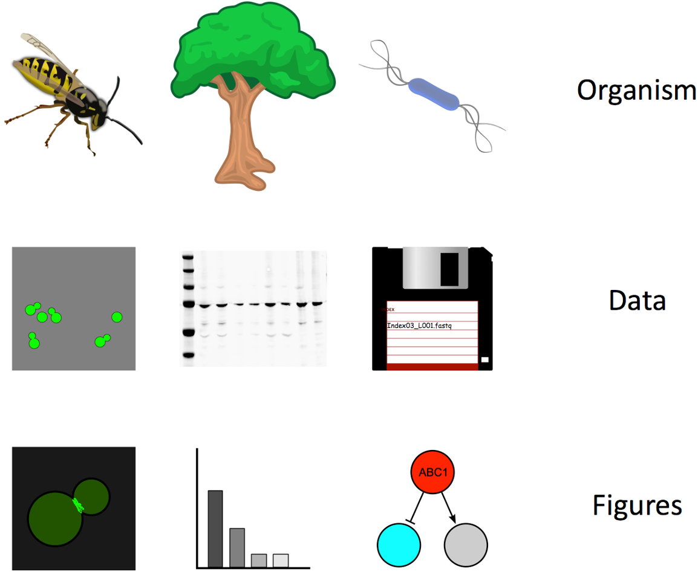

::::::::::::::::::::::::::::::::::::::: objectives

- Discuss what can go wrong and right in scientific computing

::::::::::::::::::::::::::::::::::::::::::::::::::

:::::::::::::::::::::::::::::::::::::::: questions

- How can we use computers more effectively in a scientific project?

::::::::::::::::::::::::::::::::::::::::::::::::::

Computers are now essential in all branches of science.
We use computers to collect, analyze, and store data, to collaborate, and to write manuscripts.
Yet most researchers are never taught the equivalent of basic lab skills for research computing.

This lesson covers a set of good computing practices that **every** researcher can adopt,
regardless of computational skill.
Informally, it teaches how to not lose your stuff, and generally how to be more efficient.

Many of our recommendations are for the benefit of the collaborator every researcher cares about most:
their future self (as the joke goes, yourself from 3 months ago doesn't answer email…).

Practically, future you will either:

- curse current you (bad), or
- thank current you (better).

Adopting good practices is kind to your future self.

So, which habits and practices can save you time in the future and improve your work?

:::::::::::::::::::::::::::::::::::::::  challenge

## Discuss in groups

- What can go wrong in research computing?
- What can go right in research computing?

Consider the entire data life cycle of a project, as well as the actual analysis.

1. Planning and designing
2. Collecting and capturing
3. Organizing and storing
4. Interpreting and analyzing
5. Managing and preserving
6. Publishing and sharing

:::::::::::::::  solution

## Solution

- You can lose your data
- You can re-analyze your data in 1 year's
  time and learn something important
- And many, many, more examples

:::::::::::::::::::::::::

::::::::::::::::::::::::::::::::::::::::::::::::::

## Challenges in data-heavy biology

For example, consider biology.

{alt='This image shows the many different levels of data that biologists might work with. On the highest level, they work with organisms, shown in the image are a wasp, a tree, and a bacteria. On an intermediate level, they may collect raw data from these organisms. Shown in the image are a picture of dividing yeast cells, a western blot, and a floppy disk containing text data. On the final level, they will have visualisations of the raw data. Shown in the image are a picture of dividing cells with fluorescence at the boundary, a bar plot, and a cartoon of gene transcription.'}

Biologists study organisms, and have to deal with many kinds of data.
In biology, as in other sciences:

- All your raw data are digital files
  - How do you manage them?
- There are many tools to process data
  - Too much choice, many bad choices
  - e.g. [Excel changes gene names](https://doi.org/10.1186/s13059-016-1044-7), and [loses COVID test results](https://www.bbc.co.uk/news/technology-54423988)...
- There are many levels at which to study a problem and many steps to understand
  - Where do you even start?

## Good news: everyone has these problems!

- Other people have thought about good practices and created good tools.
- You don't have to reinvent practices and tools.
- You can learn to be "good enough" in scientific computing.
- This is an ongoing process through your career.

## Principles: planning, modular organization, names, documentation

This lesson has episodes covering data management, software, project organization, collaboration, keeping track of changes, and manuscripts.

Good Enough Practices rely on a shared set of principles that span these areas:

- Planning: plan out how to work. Any plan that you can stick to is better than no plan.
- Modular organization: organize your data, code, and projects into coherent modules.
- Names: give good names to your files, folders, and functions, that make them easy to find and to understand.
- Documentation: explicitly write down everything you and your collaborators need to know in the future.

:::::::::::::::::::::::::::::::::::::::: keypoints

- Computing is essential in science and (almost) all data are digital
- A set of good enough practices can make you more efficient
- Future you will thank past you for adopting good practices
- Shared Principles: planning, modular organisation, names, documentation

::::::::::::::::::::::::::::::::::::::::::::::::::

