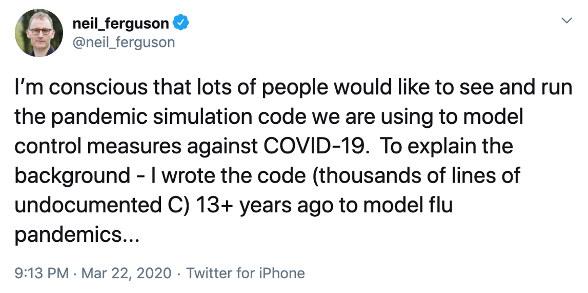

### What your future self may think...

### What is research software?

- Any code that runs in order to process your research data
- A record of all the steps used to process your data. Script everything if possible: data analysis is software.
- R, python, MATLAB, shell, openrefine, imageJ, etc. are all scriptable. Use them.

> ## Software problems
>
> Discussion – what goes wrong with software?
> *   I don’t remember what this code does
> *   This code doesn’t work any more
> *   I’m not sure if this calculation is correct
>
{: .challenge}

If you or your group are creating tens of thousands of lines of software
for use by hundreds of people you have never met, you are doing software
engineering. If you're writing a few dozen lines now and again, and are
probably going to be its only user, you may not be doing engineering,
but you can still make things easier on yourself by adopting a few key
engineering practices. What's more, adopting these practices will make
it easier for people to understand and (re)use your code.

The core realization in these practices is that *readable*, *reusable*,
and *testable* are all side effects of writing *modular* code, i.e., of
building programs out of short, single-purpose functions with
clearly-defined inputs and outputs [[hunt1999](#hunt1999)]. Much has been written on
this topic (refs!), and this section focuses on practices that best
balance ease of use with benefit for you and collaborators.

### Place a brief explanatory comment at the start of every program

no matter how short it is. That comment should include at least one example of how
the program is used: remember, a good example is worth a thousand
words. Where possible, the comment should also indicate reasonable
values for parameters. An example of such a comment is show below.

        Synthesize image files for testing circularity estimation algorithm.

        Usage: make_images.py -f fuzzing -n flaws -o output -s seed -v -w size

        where:
        -f fuzzing = fuzzing range of blobs (typically 0.0-0.2)
        -n flaws   = p(success) for geometric distribution of # flaws/sample (e.g. 0.5-0.8)
        -o output  = name of output file
        -s seed    = random number generator seed (large integer)
        -v         = verbose
        -w size    = image width/height in pixels (typically 480-800)
        -h = show help message

> ## Writing helpful explanatory comments
> __Multiple Choice__
> An example function `GetData` reads in data files of a particular type. 
> Which of the following should be included in an explanatory comment for this function? 
> 
>> ## Solution
>>
>> * "this function reads a file"
>> * file name 
>> * file type 
>> * output type 
>> * date
>> * function author 
>> * function version 
>> * data columns or other properties 
>> * expected file path / address (for example a specific directory or web address)
>> * all of the above
> {: .solution}
>> * file type 
>> * output type 
>> * data columns or other properties 
>> * expected file path / address (for example a specific directory or web address)
{: .challenge}

### Decompose programs into functions

that are no more than
one page (about 60 lines) long. A function is a reusable section of
software that can be treated as a black box by the rest of the
program. The syntax for creating functions depends on programming
language, but generally you name the function, list its input
parameters, and describe what information it produces. Functions
should take no more than five or six input parameters and should not
reference outside information.

The key motivation here is to fit the program into the most limited
memory of all: ours. Human short-term memory is famously incapable
of holding more than about seven items at once [[miller1956](#miller1956)]. If we
are to understand what our software is doing, we must break it into
chunks that obey this limit, then create programs by combining these
chunks. Putting code into functions also makes it easier to test and
troubleshoot when things go wrong.

> ## I am a problem
>
> Defined here.
>
>> ## Solution
>>
>> *   I am an answer.
>> *   So am I.
> {: .solution}
{: .challenge}

### Be ruthless about eliminating duplication

Write and re-use
functions instead of copying and pasting code, and use data
structures like lists instead of creating many closely-related
variables, e.g. create `score = (1, 2, 3)` rather than `score1`,
`score2`, and `score3`.

Also look for well-maintained libraries that already do what you're
trying to do. All programming languages have libraries that you can
import and use in your code. This is code that people have already
written and made available for distribution that have a particular
function. For instances there are libraries for statistics,
modeling, mapping and many more. Many languages catalog the
libraries in a centralized source, for instance R has
CRAN[^11], Python has
PyPI[^12], and so on. So
***always search for well-maintained software libraries
that do what you need (2d)*** before
writing new code yourself, but ***test libraries before
relying on them (2e)***.

### Give functions and variables meaningful names

both to document their
purpose and to make the program easier to read. As a rule of thumb,
the greater the scope of a variable, the more informative its name
should be: while it's acceptable to call the counter variable in a
loop `i` or `j`, things that are re-used often, such as the major
data structures in a program should *not* have one-letter names.

> ## Name that function
>
> An example function is defined in the format `functionName (variableName)`
> This function cubes every third number in a sequence.
> What are the most meaningful names for `functionName` and `variableName`? Choose one from each of the following sections:
> 
> `functionName`
> 1.   processFunction
> 2.   computeCubesOfThird
> 3.   cubeEveryThirdNumberInASequence
> 4.   cubeEachThird
> 5.   3rdCubed
> 
> `variableName`
> 1.   arrayOfNumbersToBeCubed
> 2.   input
> 3.   numericSequence
> 4.   S
>
>> ## Solution
>> `functionName`
>> 1.   processFunction - incorrect, too vague
>> 2.   computeCubesOfThird - incorrect, doesn't imply every third in sequence
>> 3.   cubeEveryThirdNumberInASequence - incorrect, too long
>> 4.   **cubeEachThird - correct, short and includes information on the data and caculation performed**
>> 5.   3rdCubed - incorrect, bad practice to put a number at the beginning of a function name (and not allowed by some programming languages)
>> 
>> `variableName`
>> 1.   arrayOfNumbersToBeCubed - incorrect, too long
>> 2.   input - incorrect, too vague
>> 3.   **numericSequence - correct, short and included information about the type of input**
>> 4.   S - incorrect, too vague
>> {: .solution}
{: .challenge}

> ## Language style guides
>
> Remember to follow each language's conventions for names, such as
> `net_charge` for Python and `NetCharge` for Java.
{: .callout}

> **Tab Completion**
>
> Almost all modern text editors provide *tab completion*, so that
> typing the first part of a variable name and then pressing the tab
> key inserts the completed name of the variable. Employing this
> means that meaningful longer variable names are no harder to type
> than terse abbreviations.

### Make dependencies and requirements explicit.

This is usually done on
a per-project rather than per-program basis, i.e., by adding a file
called something like `requirements.txt` to the root directory of
the project, or by adding a "Getting Started" section to the
`README` file.

### Do not comment and uncomment sections of code to control a program's behavior

since this is error prone and makes it difficult or impossible to
automate analyses. Instead, put if/else statements in the program to
control what it does.

### Provide a simple example or test data set

that users (including
yourself) can run to determine whether the program is working and
whether it gives a known correct output for a simple known input.
Such a "build and smoke test" is particularly helpful when
supposedly-innocent changes are being made to the program, or when
it has to run on several different machines, e.g., the developer's
laptop and the department's cluster.

### Submit code to a reputable DOI-issuing repository

upon submission of
paper, just as you do with data. Your software is as much a product
of your research as your papers, and should be as easy for people to
credit. DOIs for software are provided by
Figshare[^13] and
Zenodo[^14]. Zenodo integrates directly
with GitHub.

> ## Attribution
> Content of this episode was adopted after Wilson et al.
> [Good Enough Practices for Scientific Computing](https://github.com/swcarpentry/good-enough-practices-in-scientific-computing).
{: .callout}

## I am a section

With a text.

> ## I am a yellow info
>
> And my text.
{: .callout}

~~~
I am code
~~~
{: .source}

> ## I am a problem
>
> Defined here.
>
>> ## Solution
>>
>> *   I am an answer.
>> *   So am I.
> {: .solution}
{: .challenge}



